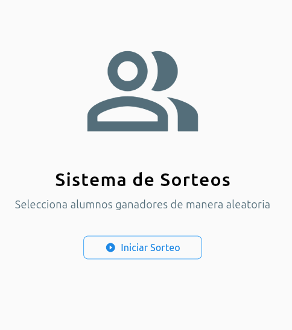
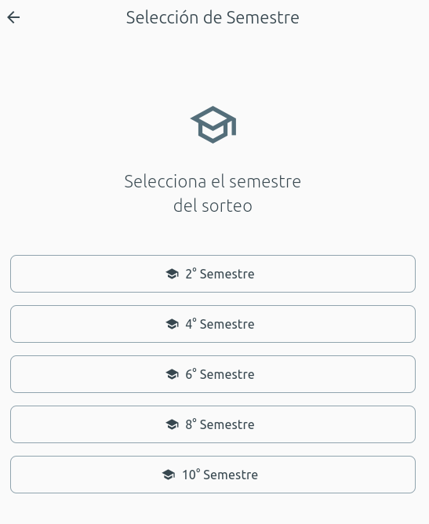
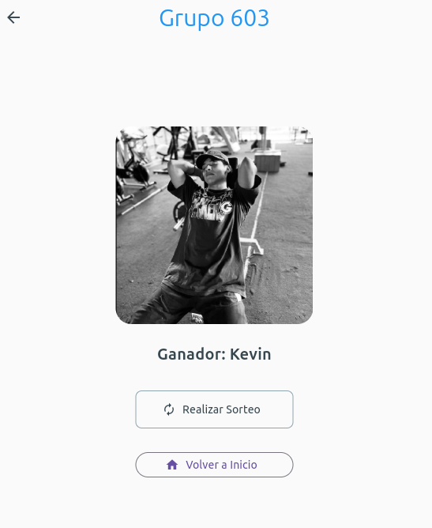

# 🎮 StudentRaffleApplication - App de Ganadores por Semestre  

Hola, este es mi repositorio **StudentRaffleApplication**, una aplicación móvil desarrollada en **Flutter (Dart)** como proyecto de examen de segundo parcial para la materia *"Programación de Dispositivos Móviles"*
impartida por el Dr.*Alberto Martínez Barbosa* en la *Universidad de la Sierra Júarez*.

Esta app permite seleccionar al azar a un ganador de un sorteo en cada semestre académico, desde **segundo hasta décimo semestre**, de manera divertida y visualmente atractiva.  

---

## ✨ Características  

- **Interfaz intuitiva**: Diseño limpio y fácil de usar.  
- **Selección aleatoria**: Elige un ganador al azar por semestre.  
- **Animaciones fluidas**: Efectos visuales para hacer el sorteo más emocionante.  
- **Personalización**: Permite ajustar nombres de participantes o semestres.   

---

## 📸 Capturas de Pantalla  

| Inicio | Selección de Semestre | Ganador Elegido |  
|--------|----------------------|-----------------|  
|  |  |  |  

---

## 🛠️ Tecnologías Utilizadas  

- **Flutter**: Framework para desarrollo multiplataforma.  
- **Dart**: Lenguaje de programación.  
- **Editor**: Visual Studio Code.  
- **Emulador**: Android Studio*  

---

## 🚀 Cómo Ejecutar el Proyecto  

1. **Clona el repositorio**:  
   ```bash
   git clone https://github.com/RafaelDiaz01/StudentRaffleApplication.git
   ```  
2. **Instala las dependencias**:  
   ```bash
   flutter pub get
   ```  
3. **Ejecuta la app**:  
   ```bash
   flutter run
   ```  

---

## 📌 Requisitos  

- Flutter SDK (versión estable recomendada).  
- Dispositivo físico o emulador con Android/iOS.  

---

## 📜 Licencia  

Este proyecto está bajo la licencia **Universidad de la Sierra Juárez**.  

---

**Desarrollador para Programación de Dispositivos Móviles**  
© 2025 - [Kevin Rafael Díaz López](https://github.com/RafaelDiaz01)  

--- 
